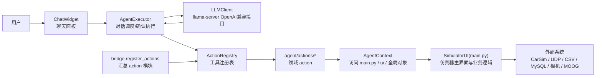
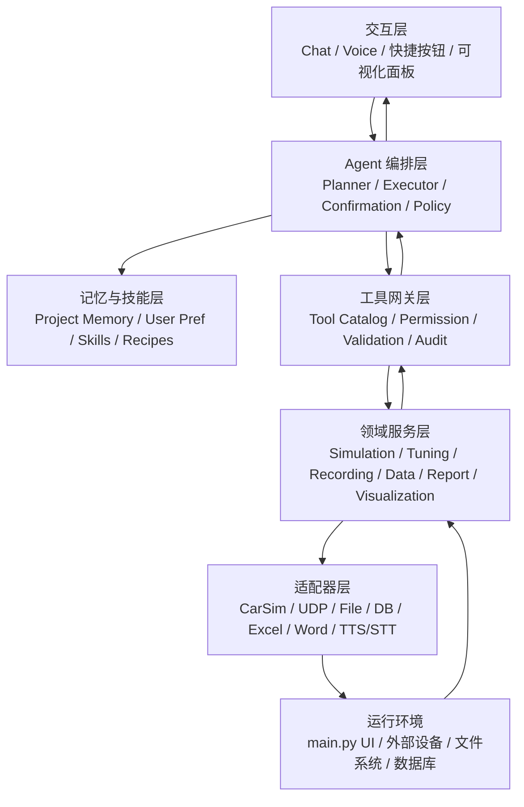
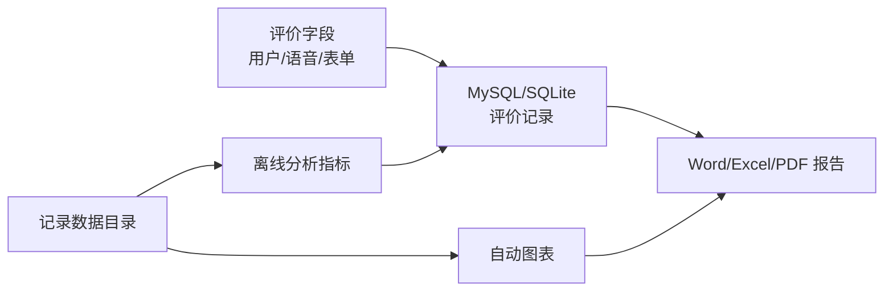
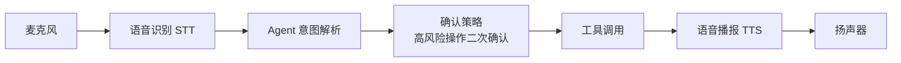
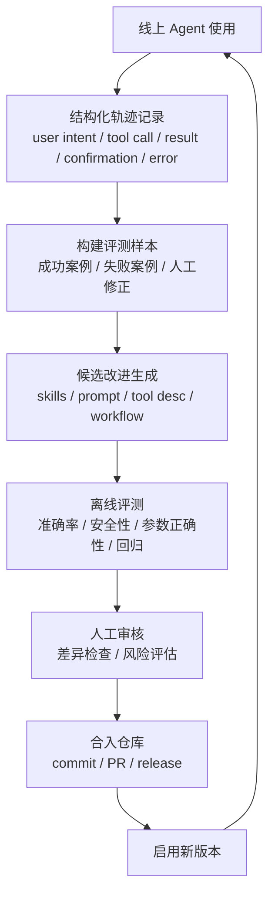
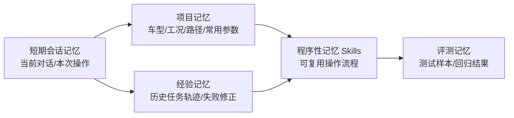

# vdAgent 智能体架构图与未来演进规划

本文面向当前 `vdAgent` 项目的 Agent 模块，目标是：

- 梳理当前 Agent 的框架图。
- 对齐后续可能实现的六类需求。
- 规划一个可逐步演进、可验证、可审计的未来架构。
- 为后续引入 Hermes-like 自进化 Agent 思路预留边界。

参考背景：

- 当前项目已有本地 LLM + function calling + action registry。
- [NousResearch/hermes-agent](https://github.com/NousResearch/hermes-agent) 的公开设计重点包括持久记忆、skills、工具系统、自动化调度、多平台交互，以及独立的 self-evolution 管线。
- [NousResearch/Hermes-Agent-Self-Evolution](https://github.com/NousResearch/Hermes-Agent-Self-Evolution) 项目强调用 DSPy + GEPA 之类的优化流程去改进 skills、prompt、tool descriptions 和部分代码，但这类自进化不应直接越权操作模拟器硬件。

## 1. 当前 Agent 架构

当前 Agent 本质上是一个挂载在 PyQt 主窗口上的自然语言控制层。



当前关键文件：

- [agent/bootstrap.py](/D:/codex/codex-IM/vdAgent/agent/bootstrap.py)
  负责 `attach_agent(self)`，创建 context、registry、executor、chat dock。
- [agent/executor.py](/D:/codex/codex-IM/vdAgent/agent/executor.py)
  负责对话历史、调用 LLM、解析 tool call、请求用户确认、执行 action。
- [agent/llm_client.py](/D:/codex/codex-IM/vdAgent/agent/llm_client.py)
  负责访问本地 `llama-server`，并兼容标准 tool call 和文本 JSON fallback。
- [agent/registry.py](/D:/codex/codex-IM/vdAgent/agent/registry.py)
  负责注册 action，并导出 OpenAI function calling tools schema。
- [agent/bridge.py](/D:/codex/codex-IM/vdAgent/agent/bridge.py)
  负责聚合各领域 action 模块。
- [agent/actions/](/D:/codex/codex-IM/vdAgent/agent/actions)
  负责把 main.py 中的业务能力包装成 agent tools。
- [main.py](/D:/codex/codex-IM/vdAgent/main.py)
  仍然承载绝大多数业务逻辑、UI 状态、硬件/仿真器接口。

## 2. 当前架构的主要问题

### 2.1 action 太贴近 UI 和底层协议

很多 action 直接调用 `main.py` 的控件或底层发送函数，例如平台 0-6 指令、弹簧/防倾杆控件状态、图表开关等。这样短期可用，但长期会造成：

- LLM 可见工具数量过多。
- 工具粒度不稳定，模型容易误选。
- 业务逻辑难以测试。
- 未来语音、自动报告、自主操作都需要重复封装。

### 2.2 main.py 承载过重

`main.py` 同时负责：

- UI 构建。
- UDP 收发。
- CarSim 操作。
- 数据记录。
- 图表刷新。
- 数据库写入。
- 文件复制。
- 调参逻辑。
- Agent 挂载目标。

这导致 Agent 要做复杂任务时，只能绕过服务层直接操作 UI。

### 2.3 缺少稳定的领域服务层

未来的 Agent 需求不是简单“点按钮”，而是完整业务流程：

- 快速切换/自主操作。
- 离线数据读取与分析。
- 模拟器参数在线读取、记录、存档。
- 评价表格录入和报告生成。
- 语音交互。
- 可视化。

这些都需要稳定服务接口，而不是只暴露 UI 控件操作。

### 2.4 缺少记忆、技能和评测闭环

当前 Agent 没有长期记忆，也没有任务经验沉淀机制。后续如果要 Hermes-like 自进化，需要补齐：

- 操作日志。
- 结构化任务轨迹。
- 成功/失败样本。
- 可复用 skills。
- 离线评测集。
- 人工审核后的工具/prompt/skill 更新机制。

## 3. 未来目标架构

建议目标架构分成 7 层：



核心思想：

- UI 层只负责交互。
- Agent 编排层只负责理解意图、计划、确认、调用工具。
- 工具网关负责权限、安全、参数校验、审计。
- 领域服务层承载可测试的业务能力。
- 适配器层隔离 CarSim、UDP、数据库、文件、语音、Office 等外部依赖。
- 记忆与技能层负责沉淀经验和复用流程。

## 4. 推荐目录演进

```text
agent/
  bootstrap.py
  executor.py
  llm_client.py
  registry.py
  context.py
  bridge.py
  actions/
    ...
  services/
    simulation_service.py
    tuning_service.py
    recording_service.py
    platform_service.py
    scenario_service.py
    data_analysis_service.py
    report_service.py
    visualization_service.py
    voice_service.py
  adapters/
    carsim_adapter.py
    udp_adapter.py
    file_adapter.py
    database_adapter.py
    office_adapter.py
    speech_adapter.py
  memory/
    memory_store.py
    skill_store.py
    run_log_store.py
  policies/
    permission_policy.py
    confirmation_policy.py
    safety_policy.py
  workflows/
    quick_ops.py
    offline_analysis.py
    parameter_archive.py
    report_generation.py
  evals/
    fixtures/
    test_cases.yaml
    evaluate_agent_tools.py
  evolution/
    collect_traces.py
    propose_skill_updates.py
    run_offline_evals.py
    review_queue/
```

过渡策略：

- 不立刻大改 `main.py`。
- 先把 action 背后的逻辑逐步抽到 `services/`。
- action 只保留为薄薄的 tool wrapper。
- `main.py` 暂时仍作为 UI 和 legacy runtime。
- 新功能优先写到 service/adapters，再由 UI 和 Agent 共用。

## 5. 六类未来需求的架构映射

### 5.1 快速切换 / 自主操作类

目标：

- 一句话完成多步骤操作。
- 支持“切到某车型 + 某工况 + 某起点 + 某调参方案 + 运行仿真”。
- 支持常用流程快捷命令。
- 支持安全确认和回滚提示。

建议模块：

- `workflows/quick_ops.py`
- `services/scenario_service.py`
- `services/tuning_service.py`
- `services/simulation_service.py`
- `policies/confirmation_policy.py`

推荐工具形态：

- `quick_switch_profile(profile_name)`
- `apply_drive_scenario(vehicle, condition, map, start_point)`
- `run_simulation_workflow(config)`
- `prepare_test_run(vehicle, tuning, scenario, recording_options)`

不建议继续暴露过多底层工具：

- 不建议让 LLM 直接操作 `platform_control(0-6)`。
- 不建议让 LLM 分别调用 4 个弹簧工具。
- 不建议让 LLM 自己拼“选择场景 -> confirm_scene”这种半成品链路。

### 5.2 离线数据读取与分析

目标：

- 自动读取某次记录目录。
- 识别 IMU / CarSim / MOOG / Visual / DisusX 数据。
- 自动对齐时间轴。
- 生成指标、图表、异常摘要。
- 支持自然语言查询，例如“帮我分析昨天那组蛇形工况的横摆角速度峰值”。

建议模块：

- `services/data_analysis_service.py`
- `adapters/file_adapter.py`
- `workflows/offline_analysis.py`
- `services/visualization_service.py`

推荐能力：

- `load_test_run(folder)`
- `summarize_test_run(run_id)`
- `compare_runs(run_ids, metrics)`
- `detect_anomalies(run_id, channels)`
- `export_analysis_charts(run_id, output_dir)`

依赖：

- `pandas`
- `numpy`
- `pyqtgraph` 或 `matplotlib`
- 后续可引入结构化 run index，例如 SQLite。

### 5.3 模拟器参数在线读取、记录、存档

目标：

- 在线读取当前 CarSim 车型、弹簧、防倾杆、工况、视觉补偿、触感参数。
- 记录每次变更。
- 保存为可追溯参数快照。
- 支持 diff：当前参数 vs 上一次参数 vs baseline。

建议模块：

- `services/tuning_service.py`
- `services/parameter_archive_service.py`
- `adapters/carsim_adapter.py`
- `memory/run_log_store.py`

推荐能力：

- `read_current_vehicle_setup()`
- `read_current_tuning_params()`
- `snapshot_simulator_params(label, metadata)`
- `diff_param_snapshots(a, b)`
- `restore_param_snapshot(snapshot_id)`

关键原则：

- 所有写入 CarSim 的操作都应有操作日志。
- 关键调参写入前需要 confirmation。
- 记录参数快照时要附带用户、时间、车型、工况、数据目录、备注。

### 5.4 评价表格便捷录入 + 报告自动化生成

目标：

- 记录结束后自动收集评价信息。
- 允许语音/自然语言补全评价字段。
- 自动生成 Excel/Word/PDF 报告。
- 将图表、指标、评价结论合并到报告。

建议模块：

- `services/report_service.py`
- `adapters/database_adapter.py`
- `adapters/office_adapter.py`
- `workflows/report_generation.py`

推荐能力：

- `create_evaluation_record(run_id, fields)`
- `update_evaluation_record(record_id, patch)`
- `generate_test_report(run_id, template)`
- `generate_comparison_report(run_ids, template)`
- `export_report(report_id, formats=["docx", "pdf"])`

数据流：



### 5.5 语音交互

目标：

- 支持免手操作。
- 支持“语音命令 -> Agent 解析 -> 安全确认 -> 执行”。
- 支持语音播报执行结果。
- 支持实验场景中的短命令，例如“开始记录”“停止记录”“运行下一组方案”。

建议模块：

- `services/voice_service.py`
- `adapters/speech_adapter.py`
- `policies/confirmation_policy.py`

推荐链路：



安全建议：

- 语音命令默认只允许低风险操作。
- 高风险操作必须弹窗或语音二次确认。
- 平台运动、清理数据、写 CarSim 参数、开始自动驾驶员回放都应进入高风险策略。

### 5.6 可视化

目标：

- 当前实时图表继续保留。
- 增加 Agent 可解释可视化，例如当前任务计划、工具调用、参数 diff、数据分析摘要。
- 支持自动生成报告中的图表。

建议模块：

- `services/visualization_service.py`
- `services/data_analysis_service.py`
- UI 新增 `Agent Trace` 或 `Analysis Dashboard` 面板。

推荐能力：

- `render_signal_overview(run_id)`
- `render_param_diff(snapshot_a, snapshot_b)`
- `render_agent_trace(trace_id)`
- `render_metric_dashboard(run_id)`

可视化对象：

- 实时信号曲线。
- 离线数据对比。
- 操作链路。
- 参数快照 diff。
- 报警/异常时间点。
- Agent 计划与执行结果。

## 6. Hermes-like 自进化 Agent 规划

### 6.1 不建议一开始让 Agent 自己改生产代码

当前项目涉及：

- 运动平台。
- CarSim/DSpace。
- UDP 实时控制。
- 数据记录。
- 试验评价数据。

因此自进化必须先做成离线、安全、可审核的管线，而不是让运行中的 Agent 自己改 action 并立即生效。

### 6.2 推荐的自进化闭环



### 6.3 自进化对象分级

优先允许自动提出改进：

- tool description。
- system prompt。
- workflow recipe。
- skill 文档。
- 参数解析规则。
- 离线数据分析模板。
- 报告模板字段映射。

谨慎允许自动提出改进：

- action wrapper。
- service 层非硬件写入逻辑。
- 数据分析指标计算。

默认不允许自动直接改动：

- UDP 下发协议。
- 平台运动控制。
- CarSim 写参数逻辑。
- 记录数据删除逻辑。
- 数据库 schema 迁移。
- 任何绕过确认策略的代码。

### 6.4 需要新增的自进化基础设施

- `run_log_store`
  记录每次用户意图、工具调用、参数、确认、结果、异常。
- `skill_store`
  保存可复用流程，例如“蛇形工况离线分析”“一键生成评价报告”。
- `evals/test_cases.yaml`
  保存自然语言意图到目标工具调用的评测集。
- `evolution/propose_skill_updates.py`
  基于失败样本生成 skill/prompt/tool 描述改进建议。
- `evolution/run_offline_evals.py`
  回放评测集，确保新 prompt/skill 没有降低稳定性。
- `evolution/review_queue/`
  保存待人工审核的候选改进。

### 6.5 Agent 记忆分层



建议先做：

- 项目记忆：保存常用路径、车型别名、工况别名、默认报告字段。
- 技能记忆：保存常用操作 recipe。
- 经验记忆：只记录结构化摘要，不保存过多原始对话。

## 7. Tool 设计建议

### 7.1 从底层 action 改为业务工具

当前工具偏底层。未来建议把 tools 设计成更稳定的业务意图。

示例：

| 当前工具 | 未来工具 |
| --- | --- |
| `select_front_spring` / `select_rear_spring` | `set_spring(position, side, value)` |
| `select_map_and_start_point` + `confirm_scene` | `apply_scene(map, start_point)` |
| `platform_control(command)` | `start_platform()` / `stop_platform()` / `reset_platform()` |
| `set_plot_visibility` / `set_all_plots` | `configure_plots(channels, mode)` |
| `set_preset` | `update_evaluation_defaults(fields)` |
| `clear_offline_data` | 默认不暴露，放入管理员/高风险工具 |

### 7.2 工具分级

```text
L0 查询类
  get_current_setup
  get_recording_status
  summarize_loaded_data

L1 UI/显示类
  configure_plots
  set_plot_time_range
  show_analysis_dashboard

L2 常规操作类
  start_recording
  stop_recording
  apply_scene
  run_offline_analysis

L3 高风险操作类
  run_carsim
  write_tuning_params
  platform_start
  operation_data_replay

L4 破坏性/管理员类
  clear_offline_data
  restore_param_snapshot
  database_migration
```

执行策略：

- L0/L1 可直接执行。
- L2 默认确认。
- L3 必须确认，并展示影响范围。
- L4 默认隐藏，只能通过管理员模式启用。

## 8. 推荐实施路线

### 阶段 1：整理现有 Agent 工具

目标：

- 缩减直接暴露给 LLM 的工具数量。
- 合并重复工具。
- 加入工具分级和确认策略。

建议任务：

- 新增 `policies/confirmation_policy.py`。
- 给 `ActionRegistry.register` 增加 `risk_level`、`category`、`exposed` 元数据。
- 将高风险和内部工具默认从 tools schema 中隐藏。
- 合并弹簧、防倾杆、场景确认等工具。

### 阶段 2：抽取领域服务层

目标：

- 将 `main.py` 中的业务逻辑逐步抽到 services。
- action 只调用 service。
- UI 和 Agent 共用同一套服务。

建议优先级：

1. `recording_service.py`
2. `scenario_service.py`
3. `tuning_service.py`
4. `simulation_service.py`
5. `data_analysis_service.py`
6. `report_service.py`

### 阶段 3：离线数据分析与报告自动化

目标：

- 先解决高价值、低硬件风险场景。
- 建立 Agent 的结构化输出能力。

建议产物：

- 记录目录索引。
- 离线分析服务。
- Excel/Word 报告模板。
- 自动图表导出。
- 评价字段自然语言补全。

### 阶段 4：记忆与技能系统

目标：

- 保存常用配置和流程。
- 支持“记住这个流程，下次直接执行”。

建议产物：

- `memory/project_memory.json` 或 SQLite。
- `skills/*.md` workflow recipe。
- `run_logs/*.jsonl` 操作轨迹。

### 阶段 5：语音交互

目标：

- 让驾驶模拟器现场操作更顺手。

建议先做：

- 语音输入转文本。
- 只开放 L0-L2 操作。
- 高风险操作语音二次确认。
- 执行结果 TTS 播报。

### 阶段 6：Hermes-like 自进化

目标：

- 从真实使用中提取失败案例。
- 离线优化 skills/prompt/tool 描述。
- 人工审核后合入。

建议先做：

- 记录结构化 traces。
- 手写 30-50 条评测样本。
- 每次工具/skill/prompt 调整前跑离线评测。
- 候选改进以 Markdown patch 的形式进入 review queue。

## 9. 推荐近期落地优先级

最建议先做的 5 件事：

1. 给当前 38 个 action 增加 `risk_level`、`category`、`exposed` 元数据。
2. 将 agent tools 缩减为 15 个左右的业务级工具。
3. 新建 `recording_service.py`、`scenario_service.py`、`tuning_service.py` 三个服务，先不大改 UI。
4. 新增结构化 `run_logs`，记录每次 agent 工具调用。
5. 建立 `evals/test_cases.yaml`，为未来自进化提供评测基准。

这样做的好处：

- 立即降低 LLM 误调用风险。
- 为语音交互和自主操作打基础。
- 让报告生成和离线分析能复用服务层。
- 给 Hermes-like 自进化留下安全闭环，而不是直接让 Agent 改硬件控制逻辑。
