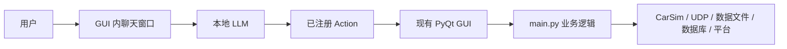
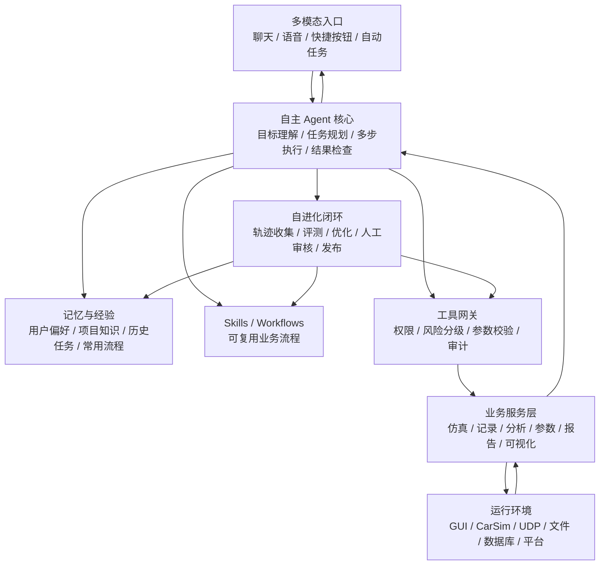
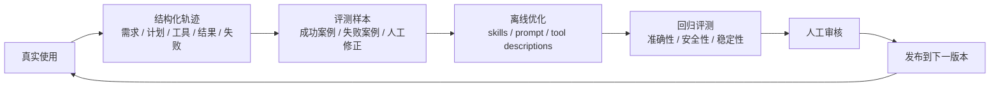

# vdAgent 智能体项目阶段判断与未来规划

## 1. 一句话定位

当前 `vdAgent` 的 Agent 还处在“挂载式 GUI 操作助手”阶段：它已经能够接入现有驾驶模拟器 GUI，通过自然语言触发页面上的相关操作，但核心能力仍然依赖 `main.py` 和 GUI 控件本身。

长远目标不应停留在“帮用户点 GUI 按钮”，而应演进为一个面向驾驶仿真业务的自主智能体平台：将仿真控制、数据分析、参数存档、评价录入、报告生成、语音交互和可视化等能力沉淀为 skills、services、tools、workflows 和 memory，让 Agent 能够根据目标自主拆解任务、多步执行、检查结果，并基于用户使用持续进化。

参考方向：

- [NousResearch/hermes-agent](https://github.com/NousResearch/hermes-agent)：公开描述中强调持久记忆、skills、自动化调度、工具网关、跨平台入口和闭环学习。
- [NousResearch/hermes-agent-self-evolution](https://github.com/NousResearch/hermes-agent-self-evolution)：公开计划中强调通过执行轨迹优化 skills、prompts、tool descriptions，并经评测和人工审核后发布。

## 2. 当前项目所处阶段

### 阶段判断：MVP 已可用，正在从“GUI 操作助手”走向“业务智能体底座”

当前已经具备：

- Agent 可以挂载到现有 PyQt GUI。
- 用户可以通过聊天窗口输入自然语言。
- LLM 可以选择已注册的 action。
- Action 可以调用 GUI 页面已有逻辑。
- 执行动作前有基本确认机制。
- 已经覆盖部分仿真、记录、调参、平台控制、场景、绘图等操作。

但当前仍然受限于：

- Agent 的能力边界等同于 GUI 页面上已经暴露的功能。
- Action 大多是 UI 操作的包装，而不是稳定的业务能力。
- 多步任务主要依靠用户反复下达指令，Agent 缺少任务规划和结果跟进。
- 没有长期记忆，不会自动沉淀用户偏好、常用流程和历史经验。
- 没有 skills 体系，复杂流程无法复用和自我改进。
- 没有结构化运行日志和评测集，后续无法可靠做自进化。
- 当前架构难以支撑语音、报告自动生成、离线分析和持续学习。

因此，项目现在处于：

> “GUI Agent 原型验证完成，进入 Agent 架构升级与业务能力服务化阶段。”

## 3. 当前架构的本质

当前逻辑可以概括为：



这个阶段的优势：

- 接入成本低。
- 不破坏现有 GUI。
- 能快速验证自然语言操作是否有价值。
- 适合演示和小范围试用。

这个阶段的瓶颈：

- Agent 只能“绕着 GUI 走”。
- GUI 状态和业务逻辑耦合太重。
- 能力不容易迁移到语音、自动化、远程执行或无界面执行。
- 工具粒度偏底层，无法稳定完成复杂任务。

## 4. 未来目标形态

未来建议把 `vdAgent` 从“GUI 附属助手”演进为“驾驶仿真智能体平台”。

目标架构应变为：



核心变化：

- GUI 不再是 Agent 的唯一能力来源。
- GUI 只是入口之一。
- 业务能力被封装为 services、tools 和 skills。
- Agent 可以自主组合多个技能完成复杂任务。
- 用户使用过程会沉淀为记忆、经验和评测数据。
- 自进化系统不直接热更新生产 Agent，而是通过离线评测和人工审核发布改进版本。

## 5. 未来需要实现的能力应如何封装

### 5.1 快速切换 / 自主操作类

目标：

- 用户说一句话，Agent 自动完成多步操作。
- 例如：“切到某车型、某工况、某起点，使用某套参数，准备记录并运行一组仿真。”

建议封装形式：

- `Skill`: 常用试验流程。
- `Workflow`: 多步骤任务编排。
- `Tool`: 单个稳定业务动作。
- `Service`: 场景、车型、参数、记录、仿真等底层能力。

示例：

- `快速准备一次试验`
- `切换到指定车型和工况`
- `运行一组离线仿真并保存结果`
- `一键启动平台安全流程`

### 5.2 离线数据读取与分析

目标：

- Agent 可以读取历史试验数据目录。
- 自动识别 CSV、信号类型、时间轴和关键指标。
- 自动给出分析摘要、异常点、对比结论。

建议封装形式：

- `Skill`: “离线数据分析流程”。
- `Service`: 数据读取、时间对齐、指标计算、异常检测。
- `Tool`: 加载数据、比较数据、生成图表。

示例：

- `读取最近一次试验数据`
- `比较两次试验的关键指标`
- `分析某工况下的速度、转角、横摆、加速度表现`
- `输出异常片段和可能原因`

### 5.3 模拟器参数在线读取、记录、存档

目标：

- Agent 能够在线读取当前模拟器参数。
- 自动记录参数快照。
- 支持参数变更前后对比。
- 支持参数档案与试验数据绑定。

建议封装形式：

- `Service`: 参数读取、快照、diff、恢复。
- `Memory`: 常用参数、历史参数、baseline。
- `Skill`: “记录当前试验配置”。

示例：

- `保存当前车辆和悬架参数快照`
- `对比当前参数与上次试验差异`
- `把当前参数和本次记录数据绑定归档`

### 5.4 评价表格便捷录入 + 报告自动化生成

目标：

- 减少试验结束后的手工录入。
- 自动补全车型、工况、调参项、评价人、数据路径。
- 自动生成图表和报告。

建议封装形式：

- `Skill`: “生成评价报告”。
- `Service`: 评价字段管理、数据摘要、图表导出、报告生成。
- `Adapter`: Excel / Word / PDF / 数据库。

示例：

- `根据本次记录生成评价表`
- `根据最近三次试验生成对比报告`
- `自动插入关键图表和结论`

### 5.5 语音交互

目标：

- 支持现场免手操作。
- 支持短命令和确认。
- 支持语音播报状态和结果。

建议封装形式：

- `Entry`: 语音入口。
- `Policy`: 高风险操作二次确认。
- `Skill`: 常用语音指令映射。

示例：

- “开始记录”
- “停止记录”
- “运行下一组方案”
- “读取当前状态”
- “生成刚才那组报告”

注意：

- 语音不应直接开放高风险底层控制。
- 平台运动、参数写入、数据清理等必须确认。

### 5.6 可视化

目标：

- 不只是显示实时曲线，还要展示 Agent 的任务状态和分析结论。

建议封装形式：

- `Service`: 图表、指标看板、参数 diff、任务轨迹。
- `Entry`: GUI dashboard。
- `Skill`: “展示本次试验摘要”。

示例：

- 当前任务执行进度。
- 当前参数快照。
- 本次试验关键指标。
- 异常时间点。
- Agent 已执行步骤和下一步计划。

## 6. Hermes-like 自进化在本项目中的正确位置

Hermes-like 自进化不应理解为“让 Agent 直接随时改代码、改控制逻辑、改硬件动作”。

在本项目中，更安全的理解是：

> Agent 从用户使用过程和执行结果中收集经验，通过离线评测优化 skills、工具描述、流程模板和部分安全范围内的代码建议，再经人工审核合入，让下一版本 Agent 更会做事。

推荐闭环：



自进化可以优先优化：

- Skill 文档。
- 常用 workflow。
- 工具说明。
- 参数提取规则。
- 报告模板。
- 离线分析流程。
- 用户偏好记忆。

自进化不应直接优化或自动发布：

- 平台运动控制协议。
- UDP 下发协议。
- CarSim 参数写入核心逻辑。
- 数据清理逻辑。
- 数据库结构迁移。
- 绕过确认策略的任何逻辑。

## 7. 建议的阶段路线图

### 阶段 0：GUI Agent 原型验证

状态：

- 当前基本已经完成。

目标：

- 验证自然语言控制 GUI 的可行性。
- 确认用户愿意用 Agent 替代部分手工操作。

代表成果：

- Agent 挂载到 GUI。
- Action registry。
- 基础 function calling。
- 操作确认。

### 阶段 1：工具治理与安全分级

目标：

- 从“很多 GUI action”收敛成“少量业务工具”。
- 明确哪些工具可直接执行，哪些必须确认，哪些默认隐藏。

关键任务：

- 给 action 增加分类、风险等级和是否暴露。
- 合并过细工具。
- 下线内部工具。
- 建立操作日志。

阶段产出：

- 稳定工具目录。
- 工具风险分级。
- 用户操作审计记录。

### 阶段 2：业务服务化

目标：

- 将 `main.py` 中的核心业务逻辑逐步抽成服务。
- GUI 和 Agent 都调用同一套服务。

关键服务：

- 仿真服务。
- 记录服务。
- 调参服务。
- 场景服务。
- 数据分析服务。
- 报告服务。
- 可视化服务。

阶段产出：

- Agent 不再只能依赖 GUI 控件。
- 业务能力可测试、可复用、可被语音/自动化调用。

### 阶段 3：Skills 与 Workflows

目标：

- 把复杂任务封装为可复用流程。
- 让 Agent 能够多步自主执行。

示例 skills：

- `准备一次标准试验`
- `运行并保存一组仿真`
- `读取最近试验数据并分析`
- `生成评价报告`
- `保存当前参数快照`

阶段产出：

- 项目级 skills 库。
- 常用 workflow 库。
- 多步执行状态跟踪。

### 阶段 4：记忆与经验沉淀

目标：

- Agent 能记住项目知识、用户偏好和历史任务。

记忆类型：

- 用户偏好。
- 常用路径。
- 常用车型和工况。
- 常用分析指标。
- 常用报告模板。
- 历史失败案例和修正方式。

阶段产出：

- 项目记忆库。
- 任务轨迹库。
- 可搜索历史经验。

### 阶段 5：语音、报告和可视化增强

目标：

- 让 Agent 从“聊天工具”升级为“现场工作助手”。

关键能力：

- 语音输入和语音播报。
- 数据分析看板。
- 报告自动生成。
- 任务进度可视化。

阶段产出：

- 现场免手操作。
- 自动报告流水线。
- 可视化任务和数据中心。

### 阶段 6：Hermes-like 自进化闭环

目标：

- Agent 能从使用中发现自己哪里做得不好。
- 自动提出 skill、prompt、工具说明、workflow 的改进建议。
- 经评测和人工审核后发布到下一版本。

关键任务：

- 建立结构化 traces。
- 建立评测集。
- 建立离线优化流程。
- 建立人工审核队列。
- 建立版本化发布机制。

阶段产出：

- Agent 能持续变好。
- 进化过程可追溯。
- 安全边界可控。

## 8. 推荐目标目录结构

```text
agent/
  actions/              # 薄封装：把业务服务暴露为工具
  services/             # 业务能力：仿真、记录、调参、分析、报告
  adapters/             # 外部系统：CarSim、UDP、文件、数据库、Office、语音
  skills/               # 可复用任务技能
  workflows/            # 多步流程编排
  memory/               # 项目记忆、用户偏好、历史经验
  policies/             # 权限、确认、安全策略
  evals/                # 离线评测集
  evolution/            # 自进化候选生成、评测、审核队列
```

## 9. 近期最应该做的事

优先级建议：

1. 先定义工具分级：查询类、显示类、常规操作类、高风险操作类、管理员操作类。
2. 将当前 action 重新梳理，保留业务级工具，隐藏底层 UI/协议工具。
3. 从 `main.py` 抽取第一批服务：记录、场景、调参、仿真。
4. 新增结构化运行日志，记录每次 Agent 的意图、计划、工具、结果和失败。
5. 建立第一批 skills：准备试验、运行仿真、读取数据、生成报告、参数快照。
6. 建立第一批评测样本，为未来自进化做准备。

## 10. 总结

当前项目已经完成了最重要的第一步：证明 Agent 可以接入现有驾驶模拟器 GUI，并通过自然语言触发实际操作。

但这只是起点。未来真正有价值的方向，是把项目从“GUI 操作助手”升级为“驾驶仿真智能体平台”：

- 能理解目标。
- 能规划多步任务。
- 能调用 skills 和 services。
- 能检查结果。
- 能生成分析和报告。
- 能通过语音和可视化融入现场工作。
- 能从用户使用中持续学习和进化。

因此，下一阶段的核心不是继续堆更多 GUI action，而是建设 Agent 的长期能力底座：业务服务化、skills、记忆、工具治理、评测和安全自进化闭环。

